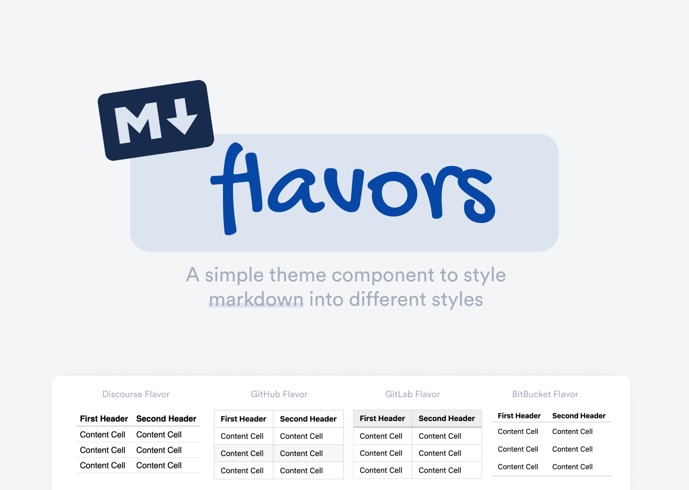
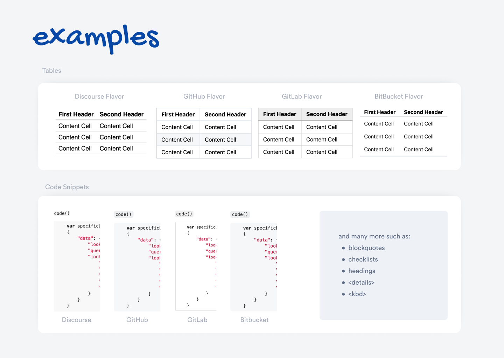

# 👅 Discourse Markdown Flavors

## 🔍 Overview

This theme component allows you to select a flavor for which markdown style you want outputted when making posts. Each markdown 'flavor' is inspired by a format of markdown commonly used on the web.

## 🔗 Info &amp; Links

| Title                 | Link                                                                                                 |
| --------------------- | ---------------------------------------------------------------------------------------------------- |
| 📄 **Documentation**  | [Read](https://thepavilion.io/t/markdown-flavors/4947)                                               |
| 👨‍💻 **Author**         | [Keegan George](https://github.com/keegangeorge/)                                                    |
| #️⃣ **Version**        | `1.0`                                                                                                |
| ❓ **How to Install** | [Installation Guide](https://meta.discourse.org/t/how-do-i-install-a-theme-or-theme-component/63682) |

## 😛 Markdown Flavors

- [GitHub](https://docs.github.com/en/github/writing-on-github/getting-started-with-writing-and-formatting-on-github/basic-writing-and-formatting-syntax) Inspired
- [GitLab](https://docs.gitlab.com/ee/user/markdown.html) Inspired
- [Bitbucket](https://bitbucket.org/tutorials/markdowndemo/src/master/) Inspired

#### Coming soon

- [AWS](https://docs.aws.amazon.com/awsconsolehelpdocs/latest/gsg/aws-markdown.html) Inspired
- [SourceForge](https://sourceforge.net/nf/markdown_syntax) Inspired

## 📝 Examples

